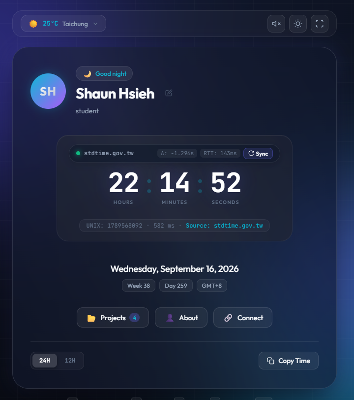

# clock_ui

**AIoT Personal Portal & Dynamic Timekeeper** — a zero-dependency single-page site that pairs a personal AIoT portal with a live clock calibrated against **Taiwan's national standard time** (stdtime.gov.tw).


課程名稱：AIoT 與數據分析（AIoT & Data Analytics, AIoT-DA）
課堂實作：DIC-1 (Do in Class 1) — 個人入口網站與動態時鐘儀表板（Personal Portal & Live Timekeeper）
儲存庫網址：https://github.com/AWEOFIJ/clock_ui/
Live Demo Page：https://aweofij.github.io/clock_ui/

Built as the Lecture 2 teaching reference for the AIoT course, it walks the whole client-side progression in one readable codebase:

> Browser → HTML/CSS → JavaScript → Fetch API / JSON → DOM Manipulation → LocalStorage → GitHub Pages



---

## Features

| # | Feature | How it works |
|---|---|---|
| 1 | **National standard time calibration** | Traces to [stdtime.gov.tw](https://www.stdtime.gov.tw/) (NML, 國家時間與頻率標準實驗室). Shows the measured device offset (Δ), network RTT, and the source that actually answered. Manual **Sync** (`S`) plus automated hourly re-calibration. |
| 2 | **Live clock** | `requestAnimationFrame`-driven digits with hours / minutes / seconds / milliseconds / UNIX timestamp, and a 12H ⇄ 24H toggle (`T`). |
| 3 | **Time-aware greeting** | Good morning / afternoon / evening / night, derived from the calibrated hour. |
| 4 | **Live weather** | Keyless [Open-Meteo](https://open-meteo.com/) API for five Taiwanese tech hubs with a click-to-select city dropdown. |
| 5 | **Async portfolio catalog** | `fetch('./projects.json')` builds the project cards in the DOM — nothing hard-coded in the HTML. |
| 6 | **Unified state** | One state tree serialized to `localStorage` under `aiot_user_state`. |
| 7 | **Procedural clock tick** | Web Audio API synthesis — zero audio files. Muted by default. |
| 8 | **Zen mode** | `Z` hides every control for an ambient desk clock; `ESC` restores. |
| 9 | **Glass drawer** | Projects / About / Connect panes in a slide-out glassmorphic panel. |
| 10 | **Three themes** | Aurora (default) ⇄ Minimal ⇄ Sunset via CSS custom properties. |

---

## Quick start

### Option A — just the site

Open `index.html` in a browser. No build step, no `node_modules`, no bundler.

Time calibration will use the public CORS-enabled fallback source, because a purely static page cannot reach `stdtime.gov.tw` directly (see below).

### Option B — with real stdtime.gov.tw calibration

```bash
python3 tools/serve.py 8091
#   site    : http://127.0.0.1:8091/
#   stdtime : http://127.0.0.1:8091/api/stdtime
```

`tools/serve.py` serves the static files **and** exposes one same-origin endpoint that proxies the national time service. Open `http://127.0.0.1:8091/` and the clock calibrates against `stdtime.gov.tw` directly.

> On a LAN you can reach it from any device at `http://<host-lan-ip>:8091/` — the server binds `0.0.0.0`.

---

## Time calibration, in detail

### The endpoint

stdtime.gov.tw exposes:

```
GET https://www.stdtime.gov.tw/Home/GetServerTime
→  "2026-09-16T22:00:38.99534+08:00"
```

A JSON string carrying an explicit `+08:00` offset, so the instant is unambiguous.

### Why the site needs a proxy

`www.stdtime.gov.tw` is an IIS host that **sends no `Access-Control-Allow-Origin` header and does not support JSONP**. Verified behaviour from a browser on another origin:

```js
await fetch('https://www.stdtime.gov.tw/Home/GetServerTime')
// ✗ TypeError: Failed to fetch                     (CORS block)

await fetch('https://www.stdtime.gov.tw/Home/GetServerTime', { mode: 'no-cors' })
// ✓ reaches the server, but the response is opaque — the body is unreadable
```

A static page therefore has no path to the value. `tools/serve.py` calls it server-side, where CORS does not apply, and re-exposes it on the same origin as `/api/stdtime`. The browser only ever talks to its own origin.

### Source order

The app tries each source in turn and the UI reports which one answered:

1. **`/api/stdtime`** — same-origin proxy to stdtime.gov.tw. Requires a server (`tools/serve.py`, or any serverless function on the same origin).
2. **`timeapi.io`** — CORS-enabled public fallback, used automatically on static hosts.
3. **Device time** — last resort; the banner reads *Device Time (Offline)*.

### Getting the offset right (three non-obvious details)

**1. `Date.parse` on a timezone-less string.** `timeapi.io` returns
`"2026-09-16T13:56:23.2168639"` — no offset suffix. Per the ES spec an offset-less date-time is parsed as **local** time, so on a GMT+8 browser the clock silently shifted by 8 hours. The fallback builds the instant from the numeric UTC fields instead:

```js
Date.UTC(json.year, json.month - 1, json.day,
         json.hour, json.minute, json.seconds, json.milliSeconds)
```

**2. Pick the fastest sample, not the median.** The client only has two timestamps, so the best correction available is `RTT / 2`. stdtime occasionally stalls for ~1 second; a slow sample then injects half that stall as phantom offset (measured: the clock ran **1.9 s fast at RTT 3.1 s**). Sampling three times and keeping the **lowest-RTT** sample — the one least contaminated by queueing — removes it.

**3. Measure on an idle main thread.** While the page is still parsing and laying out, fetch callbacks queue behind the main thread and inflate the measured round-trip (measured: **468 ms right after load vs 35 ms once settled**). The first calibration therefore waits for the `load` event.

The proxy also holds **one persistent HTTPS connection** to stdtime.gov.tw. A fresh TLS handshake per request costs 200–400 ms and lands inside the measured round-trip; reusing the socket makes every sample cost the bare server time (~10 ms locally).

---

## Deployment

The site is plain static files, so GitHub Pages works as-is:

**Settings → Pages → Deploy from a branch → `main` / root** → live at `https://aweofij.github.io/clock_ui/`.

⚠️ GitHub Pages cannot run `tools/serve.py`, so `/api/stdtime` returns 404 there and the app falls back to `timeapi.io`, labelling the source accordingly. To have the public site calibrate against stdtime.gov.tw you need a same-origin endpoint — e.g. a serverless function that performs the same upstream call.

---

## Project structure

```text
clock_ui/
├── index.html               # Semantic structure & accessibility
├── style.css                # Design tokens, themes, glass card, drawer
├── app.js                   # State, DOM engine, calibration, Web Audio
├── projects.json            # Portfolio data, loaded via fetch
├── tools/serve.py           # Static server + same-origin stdtime proxy
├── docs/screenshot.png      # Preview image used above
├── requirements.md          # Functional & non-functional requirements
├── design.md                # Architecture, data contracts, API design
└── .agents/skills/          # Workspace skills (grill-me, grilling)
```

---

## Keyboard shortcuts

| Key | Action |
|---|---|
| `S` | Calibrate now |
| `Z` | Toggle Zen mode |
| `T` | Toggle 12H / 24H |
| `C` | Copy the current timestamp |
| `ESC` | Close the drawer / exit Zen mode |

---

## Documentation

- [`requirements.md`](requirements.md) — formal FR/NFR specification (FR-1…FR-7).
- [`design.md`](design.md) — architecture, state schema, API contracts, WMO weather-code mapping.

## License

Apache License 2.0 — see [LICENSE](LICENSE).
